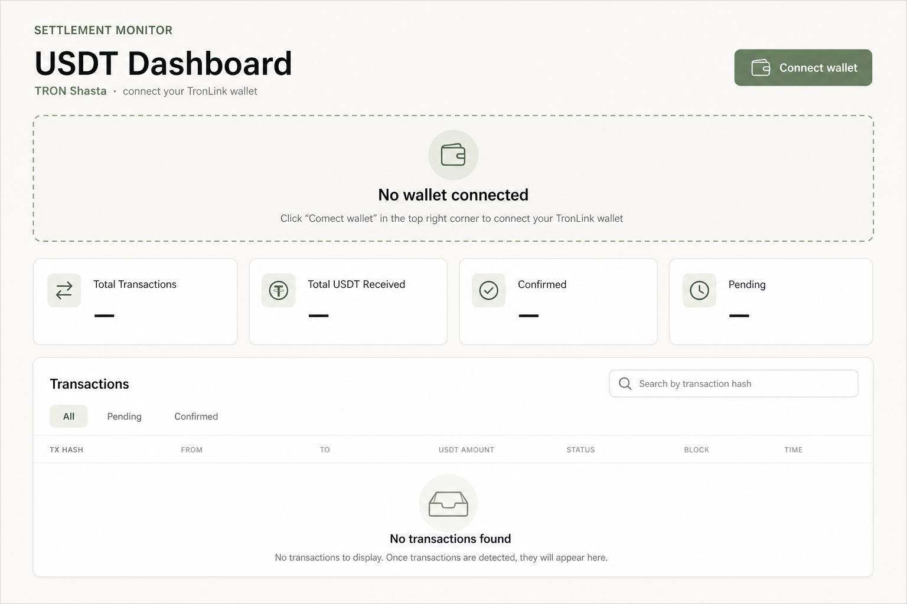
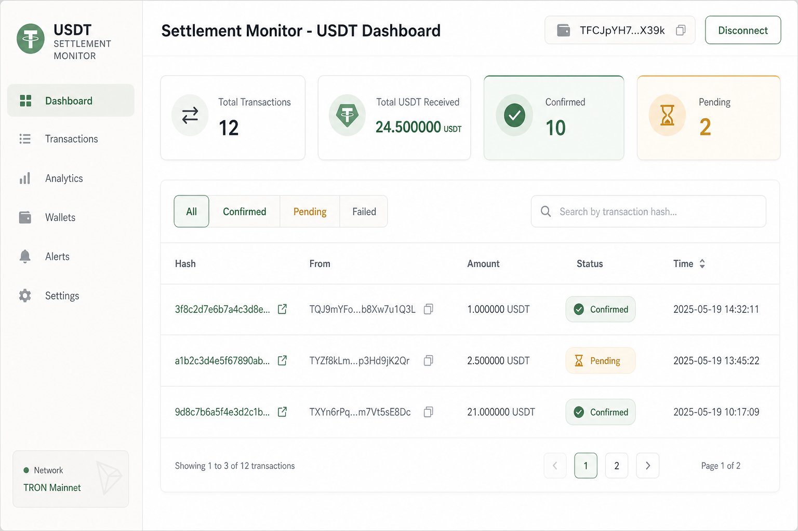

# Stablecoin Settlement Monitor

[](https://github.com/Arisangaroger/Settlement-monitoring-service-USDT-Tron-/actions/workflows/ci.yml)

**Shows USDT payments arriving in your TRON wallet** — on a live dashboard, with automatic tracking of whether each payment is still pending or fully confirmed.

Built for the Codible assessment: hybrid **TronGrid polling** (always works locally) plus  **Tatum webhooks** (near-instant when a public URL is available).

---

## What does this app do?

In everyday terms:

1. You choose a **TRON wallet address** to watch by connecting **TronLink** in the dashboard.

2. When someone sends **USDT** to that wallet on the **Shasta test network**, the app **detects the payment**.

3. The **dashboard** shows a list of incoming payments, totals, and whether each payment is **Pending** or **Confirmed**.

4. You can **search** by transaction hash to find a specific payment.

The app **does not** send crypto, hold private keys, or move funds. It **reads** public blockchain data and stores a copy in a database for fast display.

---

## Architecture & database

These diagrams are committed in the repo (`docs/diagrams/`). They render inline on GitHub when you open this README — no separate upload needed.

### System architecture


Hybrid ingestion: **TronGrid polling** and **Tatum webhooks** both feed one `IngestionService`, which deduplicates and stores in PostgreSQL. Background jobs reconcile missed events and update confirmation status.

Editable source: [docs/diagrams/architecture.mmd](docs/diagrams/architecture.mmd) · Full write-up: [docs/architecture.md](docs/architecture.md)

### Database (ERD)


- **`monitoring_wallets`** — watched addresses + poll watermark
- **`transactions`** — USDT transfers (unique `transaction_hash`)
- **`webhook_events_log`** — raw webhook audit trail

Details: [docs/erd.md](docs/erd.md)

---


## How to run it (two options)

This app is built as **webhook + polling** working together: webhooks catch payments fast; polling catches anything the webhook missed.

Webhooks need a **public URL**, which plain local Docker does not give you. So you can run it two ways:

### Option 1 — Webhooks + polling (intended experience)

This is how the app is meant to be used: near-instant webhook detection **and** polling as backup.

- Copy `.env.example` → `.env` and set `TRONGRID_API_KEY` + `TATUM_API_KEY` (free [Tatum](https://dashboard.tatum.io/) account)
- Run `npm run docker:demo`
- Open http://localhost:3001 and **Connect wallet** (TronLink on Shasta) — this sets which address to monitor
- Docker opens a temporary public tunnel and registers Tatum automatically (uses `MONITORED_WALLET_ADDRESS` if set; otherwise register the webhook URL in Tatum after you connect TronLink)
- Send test USDT — it should appear in **seconds** (webhook), not only after the poll interval

### Option 2 — Polling only (simplest local setup)

Good if you just want the stack running without tunnel setup. Transfers still show up — usually within ~3 minutes.

- Copy `.env.example` → `.env` and set `TRONGRID_API_KEY`
- Run `docker compose up --build`
- Open http://localhost:3001 and **Connect wallet** (TronLink on Shasta)
- Send test USDT to your watched wallet — the app finds it via TronGrid polling

In both options, the dashboard refreshes every ~10 seconds and confirmation status updates every 12 seconds until 19 blocks deep.

---

## Dashboard preview

**Before connecting TronLink** — connect your wallet to load stats and transactions:



**After connecting** — stats, filters, and incoming USDT transfers:



> Run the stack locally for the live dashboard. Images above are stored in `docs/screenshots/`.

---

## Glossary

- **USDT** — A US-dollar stablecoin. This project tracks **USDT on TRON** (TRC20 token standard).
- **TRON** — A blockchain network. Payments are public and readable via APIs like TronGrid.
- **Shasta** — TRON’s **test network** (fake money for development). Default in this project.
- **Wallet address** — Your public TRON account ID (starts with `T…`, 34 characters). Safe to share; like a bank account number.
- **Transaction hash** — A unique 64-character ID for one on-chain transfer. Used to search for a specific payment.
- **TronGrid** — Official TRON API used to **read** blocks and token transfers (polling).
- **Tatum** — Optional webhook provider that **pushes** payment notifications to the backend.
- **Pending / Confirmed** — **Pending** = seen on-chain but fewer than 19 blocks deep. **Confirmed** = deep enough to treat as settled.
- **TronLink** — Browser extension wallet. Used only to pick **which address** to monitor — not to sign transfers in this app.

---

## Quick start (Docker — recommended)

**TL;DR:** `cp .env.example .env` → set `TRONGRID_API_KEY` + `TATUM_API_KEY` → `npm run docker:demo` → open http://localhost:3001 → **Connect wallet**


### Prerequisites

- [Docker Desktop](https://www.docker.com/products/docker-desktop/) (or Docker Engine + Compose v2)

- Free [TronGrid API key](https://www.trongrid.io/)

- A [Shasta test wallet](https://www.trongrid.io/faucet) with some test TRX (for receiving USDT test transfers)

### Steps

```bash
git clone https://github.com/Arisangaroger/Settlement-monitoring-service-USDT-Tron-.git
cd Settlement-monitoring-service-USDT-Tron-

cp .env.example .env
```

**Option 1 — webhooks + polling** (requirements: `TRONGRID_API_KEY`, `TATUM_API_KEY`)

```bash
npm run docker:demo
```

**Option 2 — polling only** (requirements: `TRONGRID_API_KEY`)

```bash
docker compose up --build
```

Then open http://localhost:3001 and **Connect wallet** (TronLink on Shasta).

### URLs

- **Dashboard** — http://localhost:3001
- **API** — http://localhost:3000/api
- **Swagger** — http://localhost:3000/docs
- **OpenAPI JSON** — [docs/openapi.json](docs/openapi.json)
- **Health check** — http://localhost:3000/api/health

Database migrations run automatically when the backend starts.

### Verify it works (smoke test)

1. Open the **dashboard** — you should see the USDT Dashboard header.
2. Click **Connect wallet** (TronLink on Shasta) to choose the address to monitor.
3. Send a small **test USDT** transfer to your monitored wallet on Shasta.
4. Within about **3 minutes**, the payment appears in the transaction table (polling interval).
5. Use the **hash search** box to find it by transaction ID.
6. Watch status change from **Pending** → **Confirmed** (usually within a few minutes).

---

## For assessors

**How it works**

- **Polling (TronGrid)** — background job checks for new USDT every few minutes. Works in any Docker setup.
- **Webhooks (Tatum)** — Tatum pushes transfers to the backend in near real time. Needs a **public HTTPS URL** (not `localhost`).

Both paths feed the same ingestion pipeline and deduplicate on transaction hash.

**What to run**

- **Option 1 — `npm run docker:demo`** — full hybrid (webhooks + polling). Set `TRONGRID_API_KEY` and `TATUM_API_KEY` in `.env`. Docker starts the stack, opens a Cloudflare quick tunnel, and auto-registers Tatum.
- **Option 2 — `docker compose up --build`** — polling only. Webhooks will not arrive (localhost is not reachable from Tatum), but polling still proves ingestion end-to-end.

**Production note:** on a real host with a fixed public API URL, webhooks run without a tunnel.

For a stable webhook URL across restarts, see [docs/webhook-tunnel-setup.md](docs/webhook-tunnel-setup.md).

**Quick demo (Option 1)**

```bash
npm run docker:demo
```

Watch logs for `TEMP WEBHOOK BASE URL`, connect TronLink, send test USDT — it should appear in **seconds**.

**Beyond the core brief**

- Background reconciliation + confirmation jobs (pending → confirmed)
- Hybrid ingestion — Tatum webhooks + TronGrid polling with dedup on `transaction_hash`
- Structured logging (Pino), Helmet, CORS, rate limiting, DTO validation
- Backend unit + e2e tests, frontend component tests, GitHub Actions CI
- Full Docker Compose stack, Swagger UI, committed OpenAPI spec (`docs/openapi.json`)

**Key design choices (live discussion)**

- **Hybrid ingestion** — webhooks are fast; polling is the safety net if events are missed
- **Tatum over QuickNode** — QuickNode TRON webhooks are mainnet-only; this project uses Shasta + Tatum `ADDRESS_EVENT`
- **Single pipeline** — both paths normalize to the same shape before `IngestionService`
- **Amounts** — `DECIMAL(38,6)` + raw integer string; no float precision loss
- **Dedup** — unique `transaction_hash`; concurrent webhook + poll handled via insert-on-conflict
- **Jobs** — reconciliation every ~5 min; confirmation check every ~12 s; 19-block threshold
- **Wallet** — set via TronLink in the dashboard; `webhook_events_log` audits every delivery

**Known limits**

- One monitored wallet at a time, incoming USDT only, Shasta testnet, webhooks need public HTTPS

Full detail: [docs/submission-checklist.md](docs/submission-checklist.md) · [docs/technical-discussion-notes.md](docs/technical-discussion-notes.md)

---

## Troubleshooting

### Docker won’t start

- **Docker Desktop not running** — start Docker Desktop and wait until it shows “Running”.

- **Port already in use** — another app may use 3000, 3001, or 5433. Set `BACKEND_PORT`, `FRONTEND_PORT`, or `POSTGRES_HOST_PORT` in `.env`, then rebuild: `docker compose up --build`.

- **Build fails** — ensure `.env` exists (`cp .env.example .env`). Check logs: `docker compose logs backend`.


### Nothing shows on the dashboard

- **No wallet connected** — click **Connect wallet** in the header (TronLink on Shasta).
- **No USDT sent yet** — send a test USDT transfer on **Shasta** to your monitored address (not mainnet).
- **Wait for polling** — default reconciliation runs every **5 minutes**. Check backend logs: `docker compose logs -f backend`.
- **Wrong network** — `.env` must use `TRON_NETWORK=shasta` and a Shasta wallet address.
- **API unhealthy** — open http://localhost:3000/api/health ; if it fails, Postgres may still be starting. Wait 30s and retry.

### I don’t have a TronGrid key

1. Sign up at [trongrid.io](https://www.trongrid.io/) (free tier is enough for this demo).
2. Create an API key in the dashboard.
3. Paste it into `.env` as `TRONGRID_API_KEY=...`
4. Restart: `docker compose up --build`

Without a key, TronGrid rate limits are very strict and polling may fail.

### TronLink says “install extension” or Connect is disabled

- Install [TronLink](https://www.tronlink.org/) and switch the network to **Shasta** in the extension.
- Refresh the dashboard and click **Connect wallet** again.

### Webhooks don’t work locally

Expected with plain `docker compose up` — use `npm run docker:demo` or deploy to a host with a public HTTPS URL. Polling still captures all transfers.

### Regenerate API docs

```bash
npm run openapi:export
```

Requires Postgres running (uses the same bootstrap as the backend).

---

## Documentation index

- **[docs/architecture.md](docs/architecture.md)** — system context, sequences, Docker topology
- **[docs/erd.md](docs/erd.md)** — database entity-relationship diagram
- **[docs/api-contract.md](docs/api-contract.md)** — REST API envelope, endpoints, errors
- **[docs/openapi.json](docs/openapi.json)** — static OpenAPI spec
- **[docs/webhook-tunnel-setup.md](docs/webhook-tunnel-setup.md)** — ngrok / Cloudflare tunnel guide
- **[docs/security-verification.md](docs/security-verification.md)** — security measures checklist
- **[docs/submission-checklist.md](docs/submission-checklist.md)** — bonus features for assessors

---

## Architecture

The backend uses **two ingestion paths** into one pipeline:

- **Polling** — `ReconciliationJob` asks TronGrid for new incoming USDT every ~3 minutes.
- **Webhooks** — Tatum pushes events to `POST /api/webhooks/tron` when a public URL exists.

Both paths normalize into `IngestionService`, deduplicate on `transaction_hash`, and store in PostgreSQL. A **confirmation job** updates Pending → Confirmed as blocks accumulate.

See the **Architecture & database** section at the top of this README for the diagram. Sources: [docs/diagrams/architecture.mmd](docs/diagrams/architecture.mmd) · [docs/architecture.md](docs/architecture.md).

---

## Local development (without Docker)

### Prerequisites

- Node.js 22+
- Postgres (or `docker compose up postgres -d` for DB only)

```bash
npm ci
npm ci --prefix backend
npm ci --prefix frontend

cp .env.example .env
# DATABASE_URL uses port 5433 when using compose Postgres

npx prisma migrate deploy
npx prisma generate

npm run backend:dev    # terminal 1 — http://localhost:3000
npm run frontend:dev   # terminal 2 — http://localhost:3001
```

---

## Project structure

```
assessment/
├── backend/          NestJS API, jobs, webhook, ingestion
├── frontend/         Next.js dashboard
├── prisma/           Schema + migrations
├── docs/             Architecture, ERD, API contract, screenshots
├── docker-compose.yml
└── .env.example
```

---

## Database schema

- **`monitoring_wallets`** — watched addresses + poll watermark
- **`transactions`** — USDT transfers (unique `transaction_hash`)
- **`webhook_events_log`** — raw webhook audit trail

See the **Architecture & database** section at the top of this README for the ERD. Details: [docs/erd.md](docs/erd.md)

---

## API documentation

- Contract: [docs/api-contract.md](docs/api-contract.md)
- Static OpenAPI: [docs/openapi.json](docs/openapi.json) (regenerate: `npm run openapi:export`)
- Interactive: http://localhost:3000/docs (when backend is running)

- **`GET /api/transactions`** — paginated list (active wallet)
- **`GET /api/transactions/search?hash=`** — lookup by tx hash
- **`GET /api/transactions/:id`** — lookup by UUID
- **`GET /api/stats`** — dashboard aggregates
- **`GET /api/wallets/monitored`** — current monitored wallet
- **`PUT /api/wallets/monitored`** — set monitored wallet
- **`GET /api/health`** — health + DB check
- **`GET /api/webhooks/tron/status`** — webhook receiver status
- **`POST /api/webhooks/tron`** — Tatum webhook receiver

---

## Design decisions

- **Ingestion** — webhook + polling hybrid; fast path + reliability
- **Dedup** — unique `transaction_hash` + P2002; safe under concurrency
- **Amounts** — `DECIMAL(38,6)` + raw string; no float precision loss
- **Confirmations** — 19 block threshold; production-minded custodial pattern
- **Provider** — Tatum (Shasta) + TronGrid; QuickNode TRON webhooks are mainnet-only
- **Webhook security** — HMAC when secret set; dev bypass if `TATUM_WEBHOOK_HMAC_SECRET` unset

---

## Testing & CI

```bash
npm run backend:test
npm run backend:test:e2e
npm run frontend:test
```

CI runs on push — see `.github/workflows/ci.yml`.

---

## Logging & security

Structured JSON logs via **Pino** (pretty-print in development):

```bash
docker compose logs -f backend
```

- Helmet, CORS, rate limiting, DTO validation
- Webhook HMAC (`x-payload-hash`) when `TATUM_WEBHOOK_HMAC_SECRET` is set
- No secrets in the repository — [docs/security-verification.md](docs/security-verification.md)

---

## Known limitations


- Shasta testnet for development
- Live webhooks require a public HTTPS URL

---

## Environment variables

See [.env.example](.env.example) for the full annotated list.

**Required:** `DATABASE_URL`, `TRONGRID_API_KEY`  
**Wallet:** set dynamically via TronLink (**Connect wallet** in the dashboard)  
**Optional:** `MONITORED_WALLET_ADDRESS` (seed default wallet without TronLink; helps `docker:demo` auto Tatum register)  
**Optional webhooks:** `TATUM_API_KEY`, `TATUM_WEBHOOK_HMAC_SECRET`

---

## License

Assessment project — Codible technical assessment submission.
