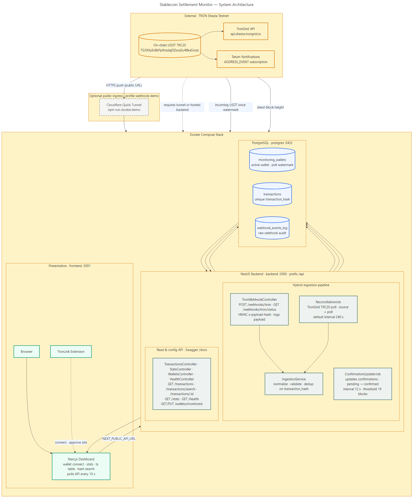
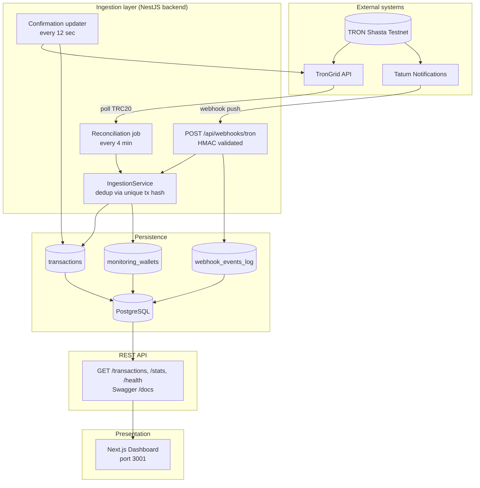
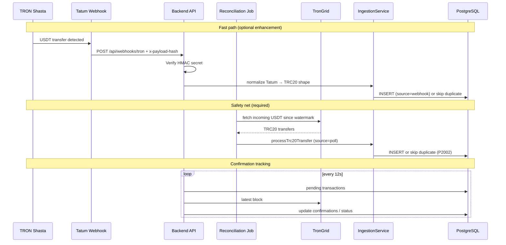
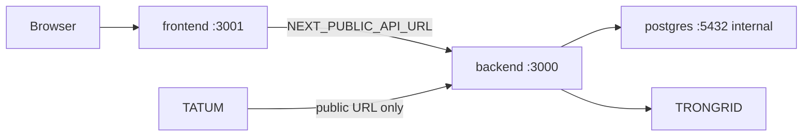

# Stablecoin Settlement Monitor — Architecture

This document reflects the **implemented** system. Verified against `prisma/schema.prisma`, NestJS modules, and `docker-compose.yml` (July 2026).

Rendered image: [architecture.png](diagrams/architecture.png) · [architecture.svg](diagrams/architecture.svg) (source: [diagrams/architecture.mmd](diagrams/architecture.mmd)).

## System context

## Data flow — dual path ingestion

## Component responsibilities

| Component | Role | Interval / trigger |
|-----------|------|-------------------|
| **Tatum webhook** | Push near-real-time token transfers | On-chain event |
| **Reconciliation job** | Poll TronGrid for missed events | 240s default |
| **Confirmation updater** | Advance pending → confirmed | 12s default |
| **IngestionService** | Validate, dedup, persist | Both paths |
| **REST API** | Read model for dashboard | On request |
| **Dashboard** | Stats, table, search, filters | Poll API every 10s |

## Deployment (Docker Compose)

## Key design decisions

1. **Hybrid webhook + polling** — webhook is fast path; polling is the reliability guarantee.
2. **Single ingestion pipeline** — both paths normalize to `TronGridTrc20Transfer` before `IngestionService`.
3. **Dedup at DB** — unique `transaction_hash`; concurrent inserts catch P2002.
4. **Numeric amounts** — `DECIMAL(38,6)` + raw string; no float for money.
5. **Confirmation threshold** — 19 blocks default (production-minded custodial pattern).

## Related docs

- [ERD](./erd.md) — database schema
- [API contract](./api-contract.md) — REST endpoints
- [Race conditions](./race-conditions.md) — dedup and job overlap
- [API security checklist](./api-security-checklist.md)
